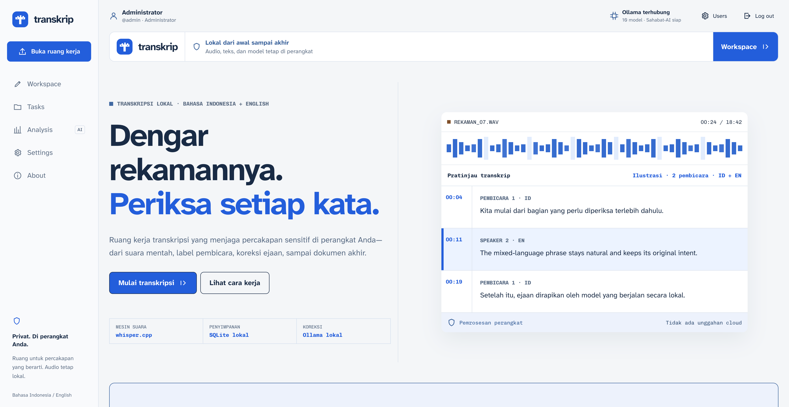
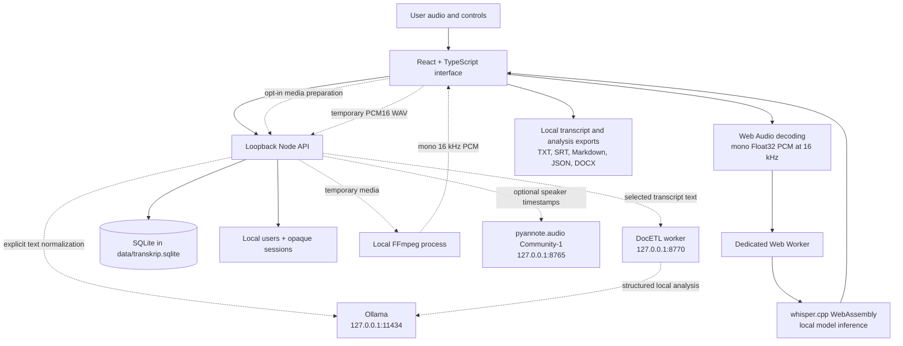

# Transkrip

**Bahasa Indonesia:** [Baca panduan utama dalam Bahasa Indonesia](README.md)

Private, device-local Bahasa Indonesia and English transcription for turning recordings into reviewable, searchable working records. Transkrip combines a React review interface, whisper.cpp WebAssembly, SQLite history, optional FFmpeg media preparation, pyannote.audio speaker diarization, and DocETL/Ollama analysis. Data remains on the user's device: no cloud transcription, cloud database, analytics, or remote error reporting is used.

Built for meetings, interviews, lectures, consultations, and oral histories across legal work, media, education, public and private organizations, HR, corporate secretariat, public communication, libraries, and archives. The shared workflow does not require an information-management background. See [PRODUCT.md](PRODUCT.md) for product direction and [MARKET.md](MARKET.md) for market research.

<p align="center">
  
</p>
**Maintainer:** Adnuri Mohamidi

[Setup](#requirements) · [Supported files](#supported-file-types) · [Large recordings](#large-audio-and-video-file-handling) · [Analysis and Word exports](#source-linked-analysis-and-word-documents) · [Commands](#commands)

## Features

- On-device Bahasa Indonesia, English, and mixed-language transcription
- Multithreaded whisper.cpp inference in a dedicated browser worker
- Base multilingual, Small Q5_1 multilingual, and Cahya Medium Q5_0 Indonesian models
- Browser audio decoding up to 250 MiB, or opt-in local FFmpeg preparation up to 2 GiB, with progress and cancellation
- Zoomable waveform with horizontal panning, seeking, and playback-follow; transcript segments retain timestamp evidence
- Editable transcript paragraphs with search and language indicators in the live workspace
- Clean TXT, timestamped SRT, and local DOCX transcript exports; DOCX also available from saved dialogue
- Settings page for selecting an installed local Ollama model, typography preset, and per-account diarization policy
- Automatic loopback Ollama connectivity check at every app start, with a signed-in status indicator and manual retry
- Distinctive voice-to-text “T” brand mark shared by every route and the browser icon
- Conservative typo correction in the workspace and bilingual dialogue normalization in task history
- Optional owner-scoped DocETL analysis for meeting minutes, action items, and cross-transcript themes
- Clickable analysis references with retained source excerpts and available timestamps; TXT, Markdown, JSON, and DOCX analysis exports
- Automatic workspace checkpoints and recovery from saved transcription chunks after reselecting the original recording
- Responsive, keyboard-accessible interface with reduced-motion support
- Device-local SQLite task history with expandable editing and immediate saves
- Owner-scoped SQLite full-text search across filenames, raw transcripts, and corrected text, with language and status filters
- Optional local speaker diarization with Auto, Required, and Off modes plus a per-transcription override
- Privacy-first landing page with transcript proof, local architecture summary, and direct workspace entry
- Monochromatic cobalt interface using one blue hue across ink, paper, controls, and semantic states
- Speaker-turn editor with inline text editing and document-wide speaker renaming
- Migration of existing transcript history into editable default-speaker documents
- Local multi-tenant accounts with administrator RBAC and owner-isolated transcription CRUD
- Opaque HttpOnly sessions, scrypt password hashing, login throttling, and same-origin mutation checks
- No public registration, analytics, cloud transcription, cloud database, or remote error reporting

## Using Transkrip

### Navigating long recordings

Use the waveform above the audio controls to move through a recording. Select a point to seek there, or drag the waveform horizontally; trackpad and touch scrolling also pan the timeline. **Perbesar gelombang** and **Perkecil gelombang** zoom in and out while keeping the time under the viewport center steady. Choose **Tampilkan seluruh rekaman** to return to the full timeline. The time labels show the currently visible range.

While audio is playing, the waveform follows the playhead as it nears the edge of the visible range. When playback is paused, panning and zooming leave the view where you put it. Keyboard users can focus **Posisi audio**, use the arrow keys to seek within the visible range, and press Home or End to jump to the start or finish.

### Preserving work through idle time and sleep

Workspace edits and completed transcription chunks now checkpoint automatically to local SQLite. Watch **Tersimpan di perangkat** in the workspace. If saving fails, keep the tab open, restore the local service, and choose **Simpan sekarang**; unfinished chunks stop before advancing without a checkpoint. **Simpan sekarang** also re-arms a conflicted checkpoint: once the local service answers, the workspace saves again without reloading the page.

After a reload, your current transcript and timestamps return. To play or continue transcribing, reselect the original audio file and load the model again. Selecting a different recording asks for confirmation before discarding the restored text, and **Ruang kerja baru** in the checkpoint bar starts a fresh workspace at any time; restored text stays reachable in Tasks. Recordings over 100 MB ask for confirmation before loading, show a read-progress bar, and decode directly at 16 kHz to keep peak memory low; preparation errors distinguish supported size/duration limits and decoding or local-service failures where possible. The file is fingerprint-checked; audio is never stored permanently. An expired session locks the interface while retaining the working session for same-account login. Dialogue edits in Tasks also autosave.

See [durable workspace recovery](docs/decisions/002-durable-workspace-recovery.md) for recovery guarantees and limits.

### Large audio and video file handling

Enable **Siapkan dengan FFmpeg lokal** before selecting a large recording. Install FFmpeg 6 or newer with the `fd` protocol available (`ffmpeg -protocols`); optionally set `TRANSKRIP_FFMPEG` to its executable path. This mode accepts up to 2 GiB, streams the original file to local disk while computing its SHA-256 fingerprint, and extracts the first audio track to 16 kHz mono PCM. Whisper still runs in the browser. No Python service is required for preparation.

The interface reports upload, conversion, and download phases and offers cancellation. One preparation runs at a time; another request receives a retry message. Allow space for the input plus up to 921.6 MB of PCM under `data/media-staging`. Use one server instance per staging directory. Temporary files are deleted after response completion, failure, or cancellation. A hard process stop can leave files until the next preparation. This is ordinary file deletion, not secure erasure.

This avoids holding the compressed input in browser memory for decoding, but the complete PCM and Whisper model still occupy browser memory. It does not provide streaming transcription, a durable batch queue, or a guarantee that every 2 GB recording will fit a device. Original-media playback remains browser-codec dependent. Browser-decoder cancellation discards the result when native decoding returns; the native API itself is not interruptible.

In browser mode, audio and MP4 imports use `OfflineAudioContext.decodeAudioData` at 16 kHz, followed by mono conversion. There is no media-element extraction fallback. FFmpeg preparation is explicitly enabled by the user and has a ten-minute server deadline. A video that plays in the browser is not necessarily decodable by this API.

Both codec compatibility and available memory can cause import failures. Browser decoding was checked with a 115.2 MB, ten-minute stereo WAV and a two-second MP4/AAC recording. Local FFmpeg preparation was checked with a 276 MB, 24-minute stereo WAV and a short MKV/AAC recording in Chromium on macOS; these checks do not guarantee every file or browser. See [audio processing verification](docs/audio-processing-performance.md) for measurements and limits.

If a recording cannot be decoded, extract its first audio track with an external FFmpeg installation:

```bash
ffmpeg -i input.mp4 -map 0:a:0 -vn -ac 1 -ar 16000 -c:a pcm_s16le audio.wav
```

The resulting file must still fit the import limits. Split long recordings if necessary; changing a filename extension does not convert its codec. Videos without an audio track cannot produce a transcript.

### Source-linked analysis and Word documents

New analysis prompts request passage references after findings. Node accepts references only from the selected, owner-authorized transcript snapshots and attaches the actual source text, filename, source version, and available speaker-block time range. Click a reference to review its excerpt. If free-form corrections no longer match the timestamped blocks, the excerpt has no timestamp rather than borrowing an inaccurate one. Old or uncited results remain readable and show a review notice. A valid reference does not prove that the claim is supported; human review remains necessary.

Snapshots remain in the analysis record when the source transcript changes or is deleted. Delete the analysis as well to remove those retained excerpts. This is source traceability, not a signed audit trail or formal approval workflow.

Workspace and saved-dialogue DOCX exports include transcript text and available speaker/time labels. Analysis DOCX exports include the draft result and a source appendix with internal citation links. TXT, Markdown, and JSON analysis exports also retain the cited source snapshots. Word generation is local and loaded only when an export is requested; DOCX is an output format, not an input format.

See [reviewed-record implementation notes](docs/decisions/003-reviewed-record-workflow.md) for scope and remaining work.

## Full-stack architecture

Transkrip is a local-first full-stack application. Its Node service binds to loopback, persists structured transcript data in SQLite, serves the production interface, and connects only to fixed loopback model services. Speech recognition remains in the browser. Audio decoding uses the browser by default, with optional FFmpeg preparation on the same device. When diarization is enabled, the browser sends a bounded temporary WAV to Node and pyannote.audio on the same device; the WAV is deleted after finalization.



| Layer | Technology | Responsibility |
|---|---|---|
| Interface | React 19, TypeScript 6, CSS | Audio controls, transcript review, editing, search, export, and status feedback |
| Build/runtime | Vite 8, Node.js 24 | Development orchestration, production serving, security headers, SQLite API, and fixed loopback integrations |
| Audio | Web Audio API; optional FFmpeg 6+ | Browser decoding or bounded loopback preparation, producing mono 16 kHz PCM |
| Word export | Lazy-loaded `docx` library | Generate local transcript documents and analysis source appendices |
| Speech engine | whisper.cpp, WebAssembly, Web Workers | Chunked on-device inference without blocking the interface |
| Local language service | Ollama + selectable local model | Optional typo correction and per-speaker bilingual normalization; no cloud endpoint |
| Quality | Vitest, ESLint, TypeScript, GitHub Actions | Tests, static analysis, checksums, builds, and dependency audits |
| Persistence/API | Node HTTP, built-in `node:sqlite`, and SQLite FTS5 | Atomic transcript writes, owner-scoped full-text search, bounded local API, task history, and privacy-safe request metadata |
| Identity and RBAC | Scrypt credentials, opaque server sessions, HttpOnly cookies | Admin-only account management and owner-only transcription access |
| Persistence | SQLite, browser session, and explicit file export | Raw text, structured speaker blocks, labels, and task state are stored locally; audio bytes are never written to SQLite |
| Speaker diarization | pyannote.audio 4 Community-1 sidecar | Optional loopback speaker timestamps aligned to browser Whisper segments |
| Local document analysis | DocETL 0.3.0 sidecar + Ollama | Explicit meeting minutes, action-item extraction, and cross-transcript synthesis over owner-selected completed tasks |

### Data and privacy boundaries

- Whisper inference occurs in the browser. Optional FFmpeg preparation sends the selected file to the authenticated loopback Node service, streams it to a temporary local file, and returns mono 16 kHz PCM. Temporary media is removed on completion, failure, or cancellation; leftovers from a killed process are removed when preparation next starts.
- Whisper models remain in browser memory. Audio is never sent to a cloud service.
- With optional diarization, a mono 16 kHz WAV is created only after the fixed-loopback sidecar reports ready and the selected mode permits it. The WAV is staged under a server-generated task ID, processed locally, and deleted after success, error, malformed finalization, or service restart.
- Each incoming Whisper segment is appended to `data/transkrip.sqlite`. SQLite stores the audio filename, language, raw transcript, formatted speaker blocks, speaker labels, and task metadata—not audio bytes.
- Full-text search is computed locally by SQLite FTS5. Its external-content index contains only filename, raw-transcript, and corrected-text copies derived from canonical rows; database triggers keep it synchronized and tenant ownership is always enforced through the canonical `transcriptions` table.
- The page CSP restricts connections to the application origin.
- Text reaches Ollama only through user-requested correction, dialogue normalization, or analysis. Analysis sends selected transcript passages through the local DocETL worker.
- At startup, Node checks only Ollama's loopback `/api/tags` metadata endpoint. It does not start Ollama, load a model, or send audio, transcripts, prompts, filenames, or account data.
- Server-side normalization connects exclusively to `http://127.0.0.1:11434/api/chat`.
- Diarization readiness and processing connect exclusively to `http://127.0.0.1:8765/health` and `/diarize`.
- DocETL analysis connects exclusively to `http://127.0.0.1:8770`, receives only the completed transcripts explicitly selected by the signed-in owner, and has no SQLite credentials or database access.
- DocETL input, intermediate results, and LLM cache live in process-owned temporary directories and are deleted when the worker exits. Its ignored `.transkrip-cache/` contains only non-content font metadata needed for faster startup.
- Hugging Face credentials are read only by the optional Python process while loading Community-1; they are never accepted by the web API or stored in SQLite.
- Production and support logs must never contain request bodies, prompts, filenames, transcripts, or exported content.
- Passwords are scrypt-derived with per-user random salts. Session tokens are random, stored only as SHA-256 digests, and sent in HttpOnly SameSite=Strict cookies.
- Administrators manage accounts but have no API bypass into another user's transcripts.

## Requirements

- macOS, Linux, or Windows; the application has no operating-system or CPU/GPU-vendor allowlist
- Node.js 24 or newer
- npm 12 (declared by `packageManager` in `package.json`)
- Git LFS for the bundled browser models
- A current Chromium-family browser for the most predictable threaded WASM and large-model support
- Optional: FFmpeg 6 or newer with the `fd` protocol for large-media preparation; this feature does not require Python
- Optional: Ollama for local typo correction, bilingual normalization, and DocETL analysis
- Optional: Python 3, FFmpeg, a separate virtual environment, and accepted Community-1 model access for multi-speaker diarization
- Optional: Python 3.10 or newer in a separate virtual environment for local DocETL analysis; Python 3.12 is the recommended compatibility target
- Optional: Emscripten SDK only when rebuilding whisper.cpp

### Platform and hardware policy

Transkrip uses the same browser and Node.js code on macOS, Linux, and Windows. Hardware eligibility is determined only by the selected ASR model's memory requirement—not by operating-system name, processor brand, or GPU vendor. The browser-reported logical CPU count changes the bounded worker count and therefore expected speed, but it does not exclude a device.

| ASR model | Minimum system RAM | Recommended system RAM | Compute profile |
|---|---:|---:|---|
| Base multilingual | 4 GB | 8 GB | Lowest CPU and memory cost; Bahasa Indonesia + English |
| Small Q5_1 multilingual | 6 GB | 8 GB | Balanced accuracy and speed; Bahasa Indonesia + English |
| Cahya Medium Q5_0 | 8 GB | 16 GB | Highest CPU cost; optimized for Bahasa Indonesia |

These are total system-memory targets, not model-file sizes. The browser also needs memory for the WebAssembly heap, decoded PCM audio, interface, and local persistence requests. Transkrip uses `navigator.deviceMemory` only when the browser provides it. Because that value may be rounded, capped, or unavailable, an unavailable value never causes an operating-system-based rejection; runtime allocation errors remain bounded and direct the user to a smaller model.

The current WebAssembly speech engine is CPU-based on all three operating systems. A GPU is neither required nor used for ASR inference, so VRAM, CUDA, ROCm, DirectML, and Metal support do not affect model eligibility. Native GPU backends would be separate platform-specific products rather than hidden behavior in this browser build.

## Quick start

### First installation

Copy the environment template and replace the bootstrap values before the first account-aware run:

```bash
cp .env.example .env
```

On Windows PowerShell:

```powershell
Copy-Item .env.example .env
```

Use a unique password of 12–128 characters. `.env` is ignored by Git. It is read by the Node 24 `--env-file-if-exists` option and the password is needed only while bootstrapping a database with no users. Never reuse an operating-system, email, or cloud-service password.

Then, from the project directory:

```bash
git lfs install
npm ci
npm run check
npm run dev -- --host 127.0.0.1
```

Open [http://127.0.0.1:5173](http://127.0.0.1:5173). Binding to `127.0.0.1` keeps the development server private to the current device.

The development command starts both Vite and the local API. For a production-local run, use `npm run build && npm start`, then open [http://127.0.0.1:8787](http://127.0.0.1:8787). The root URL opens the product landing page; use `#workspace` to open the transcription workstation directly.

Sign in with `TRANSKRIP_ADMIN_USERNAME` and `TRANSKRIP_ADMIN_PASSWORD`. The first start creates the administrator and assigns every legacy pre-account transcription to that administrator. After the first successful start and login, remove every `TRANSKRIP_ADMIN_*` bootstrap entry from `.env`; the password hash remains in SQLite and an existing database with a user no longer requires bootstrap variables. Do not leave only a username or only a password configured, because partial bootstrap credentials are rejected. Do not lose the administrator credential: this local-only release intentionally has no email or cloud password-recovery channel.

### Existing installation and restart

Once at least one account exists, start the production-local application without a bootstrap password:

```bash
npm start
```

Open [http://127.0.0.1:8787](http://127.0.0.1:8787) and sign in with the stored local account. `npm start` serves the most recent `dist/`; run `npm run build` first whenever application source changed. To stop the foreground process, press <kbd>Ctrl</kbd>+<kbd>C</kbd>. The same commands work in macOS, Linux, and Windows terminals supported by Node.js.

Before the first RBAC migration or any application upgrade, stop Transkrip and back up the SQLite database together with any adjacent write-ahead-log files:

```text
data/transkrip.sqlite
data/transkrip.sqlite-wal
data/transkrip.sqlite-shm
```

Copy only files that exist and restore them only while Transkrip is stopped.

The npm commands are identical in macOS Terminal, Linux shells, Windows PowerShell, and Windows Terminal. Platform-specific package installation is needed only for optional external tools such as Git LFS, FFmpeg, Python, Ollama, or Emscripten.

## Environment variables

All environment variables are read through Node 24's `--env-file-if-exists` option from `.env` at the project root. Copy `.env.example` to `.env` before the first run.

| Variable | Default | Purpose |
|---|---|---|
| `TRANSKRIP_ADMIN_USERNAME` | — | Bootstrap administrator username; required only when the database has no users |
| `TRANSKRIP_ADMIN_PASSWORD` | — | Bootstrap administrator password (12–128 chars); must be set together with the username |
| `TRANSKRIP_ADMIN_DISPLAY_NAME` | falls back to username | Display name shown in the account bar for the bootstrap administrator |
| `TRANSKRIP_HOST` | `127.0.0.1` | Bind address for the Node HTTP server |
| `TRANSKRIP_PORT` | `8787` | Port for the Node HTTP server |
| `TRANSKRIP_DB_PATH` | `data/transkrip.sqlite` | Absolute path for the SQLite database file |
| `TRANSKRIP_FFMPEG` | `ffmpeg` on PATH | Executable path for optional media preparation; must support the `fd` protocol |
| `TRANSKRIP_STATIC` | `1` (serve `dist/`) | Set to `0` to skip serving static files (used by `scripts/dev.mjs` for Vite) |
| `TRANSKRIP_ANALYSIS_PYTHON` | auto-discovered `.venv-analysis` | Absolute path to a Python interpreter for the DocETL worker |
| `TRANSKRIP_ANALYSIS_AUTOSTART` | `1` | Set to `0` to prevent automatic DocETL worker startup |
| `TRANSKRIP_DIARIZATION_MODEL` | `pyannote/speaker-diarization-community-1` | Hugging Face model ID used by the diarization sidecar |

Bootstrap variables are needed only on the first run when the database has no users. After the administrator account is created and verified, remove every `TRANSKRIP_ADMIN_*` entry from `.env`. Partial credentials (only a username or only a password) are rejected.

## Local task history and database

The API creates `data/transkrip.sqlite` on first run. Every real transcription creates one task, appends incoming Whisper segments atomically, then finalizes a structured speaker document. Open **Tasks** or `#tasks` to view completed rows, edit individual turns, rename a speaker throughout the document, or normalize all turns with the model selected in Settings. Raw Whisper text remains separate from formatted and normalized content.

The **Search transcripts** control searches the local filename, original Whisper text, and latest corrected text. Optional Bahasa and status filters narrow the result without changing the underlying task. Queries use literal Unicode word prefixes rather than accepting raw FTS operators, are limited to 200 input characters and eight indexed terms, and return plain-text excerpts. Search results are joined back to canonical rows with the active session's `owner_user_id`; administrators receive no cross-tenant search bypass. **Clear** restores the normal task ledger.

After the workspace has been opened, Transkrip keeps its browser worker, loaded model, decoded audio, current segments, and SQLite write queue mounted while you visit Landing, Tasks, Analysis, Settings, or About. Audio playback pauses when the workspace is hidden, but transcription continues. Segment writes begin immediately and do not wait for the optional diarization-audio upload. Processing tasks are visible in Tasks; open **Lihat progres** to read the partial text already committed to SQLite, refresh it, download a clean sentence-per-line TXT, or explicitly mark an abandoned task as interrupted.

Closing, reloading, or allowing the browser to discard the entire tab still stops browser-based inference because WebAssembly execution cannot survive a destroyed page. Acknowledged text remains recoverable in Tasks. When the workspace has a saved chunk checkpoint, reselect the original recording, reload the model, and choose **Lanjutkan transkripsi** to resume from that checkpoint; an unfinished chunk may run again. Older or abandoned tasks without a workspace checkpoint retain their partial text but cannot resume automatically. Disable aggressive browser memory-saving for long recordings.

The canonical schema contains:

| Column | Purpose |
|---|---|
| `id` | SQLite task identifier |
| `audio_file` | Display-only imported filename; never used as a filesystem path |
| `language` | `id`, `en`, or `auto` |
| `raw_transcript` | Original accumulated Whisper output |
| `corrected_text` | Latest human-edited or locally normalized transcript text |
| `formatted_transcript` | Validated JSON array of timestamped speaker blocks |
| `speakers` | Validated JSON array of stable speaker IDs and editable labels |
| `diarization_mode` | Effective `auto`, `required`, or `off` policy selected for this task |
| `status` | `processing`, `completed`, `corrected`, `edited`, or `error` lifecycle state |
| `created_at` | UTC creation timestamp |
| `updated_at` | UTC timestamp of the latest persisted task change |
| `owner_user_id` | Required owner foreign key used by every transcript query and mutation |

Compatibility columns from the earlier schema remain during this release so existing installations migrate in place. Completed legacy rows are backfilled into one editable default-speaker block without discarding their prior manual correction. `transcriptions_fts` is a derived FTS5 virtual table, not another source of truth. Insert, update, and delete triggers synchronize it with canonical transcript rows; a new installation builds it automatically and an existing installation performs a one-time rebuild when the index is first introduced.

### Accounts, roles, and tenant isolation

Every API route except health and login requires a valid server-side session. Roles are deliberately small:

- **Administrator** — creates, lists, updates, disables, resets credentials for, and deletes local accounts.
- **User** — creates, reads, updates, corrects, exports, and deletes only their own transcriptions.

Administrator status does not grant transcript access across owners. Cross-tenant transcript IDs return `404` so record existence is not disclosed. Disabling an account revokes its sessions while preserving its work. Deleting an account requires typing its username and permanently removes its sessions and owned transcriptions. The final enabled administrator cannot be disabled, demoted, or deleted, and an active administrator cannot delete their own account.

During the first RBAC migration, all pre-account transcriptions are assigned to the approved bootstrap administrator. Back up SQLite before upgrading. The `users`, `sessions`, and ownership fields remain in the same device-local database; plaintext passwords and session tokens are never stored. Each user also owns a `diarization_mode` preference; existing accounts and tasks migrate to `auto`.

### Administrator account workflow

1. Sign in with an enabled administrator account.
2. Open **Users** or navigate to `#users`.
3. Create an account with a normalized username, display name, role, and temporary password of 12–128 characters.
4. Deliver the temporary password through a trusted local channel. Transkrip does not send email or contact an identity provider.
5. Expand an account row to change its display name, role, enabled state, or password. Replacing a password and disabling an account both revoke its active sessions immediately.
6. Prefer disabling an account when its work must be retained. Permanent deletion requires typing the exact username and removes the account, its sessions, staged audio, and all owned transcriptions.

Keep at least two enabled administrator accounts for recovery. The server transactionally prevents disabling, demoting, or deleting the final enabled administrator. An administrator cannot delete the account backing their current session, and administrator status never grants access to another owner's transcript content.

### Authentication, runtime, and media API

JSON endpoints use the existing data/error envelope. A successful `POST /api/media/prepare` response instead streams binary Float32 PCM with `X-Audio-Sha256` and `X-Audio-Duration` headers. Send media as `application/octet-stream` with its `Content-Length`; same-origin and loopback checks apply. Transcript ownership always comes from the server-side session rather than a client-supplied user ID.

| Method and route | Access | Purpose |
|---|---|---|
| `POST /api/auth/login` | Public, loopback | Verify credentials and rotate an opaque session cookie |
| `POST /api/media/prepare` | Signed in; loopback only | Prepare a binary media file as mono 16 kHz Float32 PCM; up to 2 GiB, one job at a time |
| `GET /api/auth/session` | Signed in | Return the safe current-user profile and permissions |
| `POST /api/auth/logout` | Signed in | Revoke the current session and clear its cookie |
| `PATCH /api/account/preferences` | Signed in, same origin | Save the authenticated user's validated diarization default |
| `GET /api/runtime/ollama` | Signed in | Return the latest bounded Ollama connectivity snapshot |
| `POST /api/runtime/ollama` | Signed in, same origin | Recheck fixed-loopback Ollama and return the updated snapshot |
| `GET /api/runtime/ollama/models` | Signed in | Return the validated, bounded fixed-loopback Ollama model inventory used by Settings |
| `GET /api/runtime/diarization` | Signed in | Return the most recent bounded sidecar-readiness snapshot |
| `POST /api/runtime/diarization` | Signed in, same origin | Recheck fixed-loopback pyannote readiness before optional WAV creation |
| `GET /api/runtime/docetl` | Signed in | Return the bounded fixed-loopback DocETL readiness snapshot |
| `POST /api/runtime/docetl` | Signed in, same origin | Recheck the optional DocETL worker without sending transcript content |
| `GET`, `POST /api/analyses` | Signed-in owner | List owner-only runs or queue an analysis over 1–8 selected completed tasks |
| `GET`, `DELETE /api/analyses/:id` | Signed-in owner | Read or delete one owner-only persisted analysis result |
| `GET /api/admin/users` | Administrator | List local accounts without credential material |
| `POST /api/admin/users` | Administrator | Create an administrator or standard user |
| `PATCH /api/admin/users/:id` | Administrator | Change display name, role, enabled state, or password |
| `DELETE /api/admin/users/:id` | Administrator | Permanently delete an account and its owned work |
| `GET /api/transcriptions` | Signed-in owner | List owner tasks, or search them with bounded `q`, `language`, `status`, `limit`, and `offset` parameters |
| Other `/api/transcriptions*` routes | Signed-in owner | Create, read, edit, correct, and delete only the caller's work |

Missing or expired sessions return `401`; insufficient role returns `403`; protected account-state conflicts return `409`; and transcript IDs not owned by the caller return the same generic `404` as an unknown ID. Unsafe authenticated requests must originate from the application itself. Session cookies are HttpOnly and SameSite=Strict, and receive the Secure attribute when TLS is used.

The entire `data/` directory is ignored by Git. To back up history, stop Transkrip and copy `data/transkrip.sqlite` together with adjacent `-wal` and `-shm` files. Restore them only while the app is stopped. Deleting them removes local history unless you made a backup. Set `TRANSKRIP_DB_PATH` to an explicit local path when a managed installation needs a different storage location.

## Optional local speaker diarization

Transkrip works without the Python service and assigns one default `Pembicara 1` or `Speaker 1` label. To detect multiple local speakers, install FFmpeg and a separate Python environment:

```bash
python3 -m venv .venv-diarization
.venv-diarization/bin/pip install -r diarization/requirements.txt
```

Accept the conditions for [`pyannote/speaker-diarization-community-1`](https://huggingface.co/pyannote/speaker-diarization-community-1), create a Hugging Face read token, and start the loopback service in a separate terminal:

```bash
HF_TOKEN=your_read_token .venv-diarization/bin/python diarization/service.py
npm run dev -- --host 127.0.0.1
```

`HF_TOKEN` is read only by Python during model loading; Transkrip never accepts, stores, or logs it. After the model is cached, pyannote documents an offline local-model workflow. The sidecar binds only to `127.0.0.1:8765`. Node performs a bounded readiness check at startup and the browser rechecks immediately before a task that may use diarization. Do not expose either service to a LAN or public interface.

Settings stores one default per account, while the workspace selector can override it for the next transcription:

- **Auto — recommended:** create and upload a temporary WAV only when the sidecar reports ready; otherwise continue immediately with one default speaker.
- **Required:** stop before task creation when the sidecar is unavailable or the recording cannot fit the bounded WAV staging limit. If the sidecar fails after transcription begins, preserve the transcript and finalize with the safe default-speaker fallback.
- **Off:** never call the readiness endpoint and never create, stage, or upload a diarization WAV.

The selected effective mode is stored with the task for an inspectable audit trail. Regardless of mode, Whisper transcription and incremental SQLite segment writes do not depend on pyannote completing successfully.

Community-1 provides exclusive diarization timestamps designed for alignment with transcription timestamps. Results remain estimates: overlapping voices, noise, very short turns, and similar voices can be assigned incorrectly. Rename labels in the task editor when needed.

Dependency lifecycle scripts are disabled by the committed `.npmrc`. Review any dependency that genuinely requires an install script before granting a narrow exception.

## Local typo correction and bilingual normalization

Local text processing is optional. Install the recommended Sahabat-AI quantization:

```bash
ollama pull csalab/sahabatai1:llama3_base_Q4_K_M
```

Start Ollama with its default loopback binding, then run Transkrip. Every Node startup checks the fixed `http://127.0.0.1:11434/api/tags` endpoint with a three-second timeout. This is a connectivity and model-inventory probe only: Transkrip remains operating-system agnostic and never launches, stops, or warms the Ollama process. The local startup log records only the result, latency, model count, and whether the recommended alias is present.

After sign-in, the account bar reports **Memeriksa Ollama**, **Ollama terhubung**, or **Ollama tidak terhubung**. Select the indicator to retry after starting Ollama. Open `#settings` from the command bar to inspect the installed model aliases and choose the correction model. Settings reads the inventory through the authenticated same-origin `/api/runtime/ollama/models` endpoint; Node validates Ollama's fixed-loopback response before returning bounded display metadata. The browser saves only the selected model name in local storage. `csalab/sahabatai1:llama3_base_Q4_K_M` is the recommended default; its explicit quantization tag avoids silently tracking `latest`. Existing installations that still hold the former Garuda default are migrated to Sahabat-AI, while an explicitly selected custom model remains unchanged. Do not expose Ollama to the LAN or internet without redesigning the privacy model and disclosures.

Task-history normalization is handled by the Node API and works with the bundled production server. Live-workspace typo correction uses the same-origin `/ollama/api/chat` route supplied by the Vite development proxy. A custom production gateway that needs live-workspace correction must proxy `/ollama/*` exclusively to `http://127.0.0.1:11434/*`; never proxy it to a remote host.

Because this Sahabat-AI artifact is a base model rather than a safety-aligned instruction model, both operations use deterministic JSON-only prompts, temperature zero, bounded context/output, and independent structural validation:

- **Koreksi ejaan lokal** fixes only conservative typo, capitalization, spacing, and punctuation issues in the live workspace.
- **Normalisasi bilingual** operates one speaker turn at a time. It may improve paragraph readability, proper-noun capitalization, clear mishearings, and standard punctuation while preserving speaker identity, mixed Indonesian-English phrasing, facts, numbers, conversational register, and core intent.

Unsafe translations, expansions, sentence restructuring, or large word substitutions are rejected or restored from the source.

## Optional local DocETL analysis

Analysis is a first-class optional feature, not part of transcription itself. Open **Analysis** or `#analysis`, choose 1–8 completed owner-visible tasks, select an installed Ollama model and one preset, then queue the run. The Node queue persists the run before work begins, executes one job at a time to protect a 16 GB machine, and refreshes the result even if the user visits another route. Admission is bounded to two active runs per account and eight globally. Available presets are meeting minutes, action items, and themes across multiple transcripts. Interface menus use English labels; analysis guidance and results remain in Bahasa Indonesia.

Every run stores a real lifecycle phase in SQLite: `queued`, `preparing`, `generating`, `validating`, then `completed` or `failed`. The interface polls owner-scoped run state every two seconds while work is active, so changing routes or browser tabs does not erase progress. Phase changes come from actual Node-to-DocETL request milestones: queue admission, pipeline preparation, the Ollama-backed worker request, response validation, and the final database write. The elapsed display is a phase timer, not a claimed completion percentage. This release intentionally does not invent per-section counters while DocETL is executing synchronously. If Transkrip restarts with a pending or running job, that stale run becomes a visible failed record with a recovery message instead of remaining active forever; its source transcripts are unaffected.

Install the isolated worker with Python 3.12. On macOS or Linux:

```bash
python3.12 -m venv .venv-analysis
.venv-analysis/bin/pip install -r analysis/requirements.txt
```

On Windows PowerShell:

```powershell
py -3.12 -m venv .venv-analysis
.venv-analysis\Scripts\python.exe -m pip install -r analysis\requirements.txt
```

Transkrip discovers this environment and starts `analysis/service.py` automatically with the Node application. To use another interpreter, set `TRANSKRIP_ANALYSIS_PYTHON` to its absolute path. Set `TRANSKRIP_ANALYSIS_AUTOSTART=0` only when deliberately supervising the worker separately. The application remains fully usable when DocETL is absent; Analysis then shows a specific local setup status instead of sending data elsewhere.

The worker binds only to `127.0.0.1:8770`, fixes Ollama to `127.0.0.1:11434`, disables DocETL optimization, uses one model thread, bounds requests to eight documents and 500,000 characters, and treats transcript text as untrusted data rather than instructions. It never opens SQLite. The Node API resolves all task IDs through the authenticated owner before copying selected text to the worker. Results and job state are stored in the tenant-scoped `analysis_runs` table and can be exported as TXT, Markdown, or JSON.

DocETL is pinned to `0.3.0`. Two transitive packages are also pinned to official wheel-backed versions so installation does not require a Rust compiler on Intel macOS while retaining Linux, Windows, and Apple Silicon compatibility. The integration follows the official [DocETL Frame API](https://ucbepic.github.io/docetl/api-reference/python/) and [Ollama provider guide](https://ucbepic.github.io/docetl/examples/ollama/). DocETL is independently available from the [UC Berkeley EPIC repository](https://github.com/ucbepic/docetl) under the MIT license.

## Appearance and typography

Open **Settings** or `#settings` to choose one of three application-wide reading styles:

- **Evidence Console** — the default Atkinson Hyperlegible and Chivo Mono workstation style.
- **Modern Editorial** — a lighter system-sans reading voice while preserving mono evidence metadata.
- **Classic Typesetting** — an old-style serif stack for long-form transcript reading while preserving mono evidence metadata.

The selected preset applies immediately and is saved as `transkrip.appearance` in browser local storage. A small same-origin bootstrap applies it before the interface paints, preventing a default-font flash on return visits. Transkrip never downloads a font from Google Fonts or another remote font service: Evidence Console uses the font files bundled in the production build, while Modern Editorial and Classic Typesetting use privacy-safe operating-system font stacks with local fallbacks. Invalid or unavailable saved values fall back to Evidence Console.

The interface palette is intentionally monochromatic. Every authored UI color belongs to one cobalt-blue hue family, ranging from near-black navy console surfaces to pale blue-white transcript paper. Status, language, privacy, warnings, and selection never rely on hue alone: visible labels, icons, borders, patterns, and position remain the authoritative cues.

## Speech models

The browser models are stored in `public/models/` and versioned with Git LFS:

| Model | Approximate size | Recommended use |
|---|---:|---|
| `ggml-base.bin` | 141 MB | 4 GB minimum / 8 GB recommended; fastest multilingual option |
| `ggml-small-q5_1.bin` | 181 MB | 6 GB minimum / 8 GB recommended; balanced mixed Indonesian/English option |
| `cahya-ggml-medium-q5_0.bin` | 514 MB | 8 GB minimum / 16 GB recommended; Indonesian-focused, CPU-intensive option |

The Cahya browser model is derived locally with whisper.cpp's official Q5_0 quantizer from the approximately 1.53 GB [Sparkplugx1904/Indonesia-Whisper-GGML](https://huggingface.co/Sparkplugx1904/Indonesia-Whisper-GGML) fine-tune. Its F16 native source can remain in `models-native/`, which is excluded from Git and browser builds.

For mixed Bahasa Indonesia and English, use Base or Small multilingual. Do not use an `.en` model for Indonesian audio. Custom local GGML models are supported up to the browser-safe 750 MB limit.

Verify all shipped model and runtime artifacts before packaging:

```bash
npm run assets:verify
```

## Whisper processing pipeline

1. The browser decodes the selected recording, or opt-in local FFmpeg prepares its first audio track.
2. Audio is converted to mono, 16 kHz `Float32Array` PCM.
3. For Auto or Required, the browser asks Node to probe the fixed-loopback sidecar; Off skips this request entirely.
4. A temporary PCM16 WAV is created and uploaded only after a ready result. Required stops safely if readiness or bounded WAV creation fails.
5. The UI transfers the transcription PCM to `public/whisper/engine-worker.js`.
6. The worker processes overlapping 30-second batches through `Module.full_default()`. Cahya Medium uses bounded 60-second batches to reduce per-batch setup overhead.
7. Each chunk waits for whisper.cpp's real background-thread completion signal and is appended to SQLite as it arrives.
8. On completion, timestamped segments are aligned with local exclusive speaker turns; adjacent segments for the same speaker are merged.
9. If pyannote becomes unavailable after work begins, the task still completes with one language-appropriate default speaker.
10. TXT output normalizes whitespace and places each detected sentence on its own line; SRT preserves timestamps.

### Supported file types

The default recording picker requests `audio/*,video/mp4`; optional local FFmpeg preparation expands it to audio and video, including MOV, MKV, AVI, and WebM. This is a file-selection filter, not a guarantee that the browser can decode every matching file. Actual support depends on the container, embedded audio codec, browser, and operating system.

| Use | File types | Support and limitations |
| --- | --- | --- |
| Audio import | WAV (`.wav`), MP3 (`.mp3`), M4A/AAC (`.m4a`, `.aac`), Ogg (`.ogg`, `.oga`, `.opus`), FLAC (`.flac`), audio WebM (`.webm`) | Selectable when recognized as audio by the file picker. Decoding depends on browser codec support; PCM WAV was verified in Chromium. |
| Video import | MP4 (`.mp4`) with an audio track | Explicitly included in the picker. MP4 with AAC audio was verified in Chromium; other embedded codecs are not guaranteed. Only audio is transcribed. |
| Other video containers | MOV, MKV, AVI, video WebM | Available with optional FFmpeg preparation; MKV/AAC was checked in Chromium on macOS. Codec support depends on the installed FFmpeg build. Original recording playback still depends on the browser. |
| Local speech model import | GGML (`.bin`) | Must be a compatible whisper.cpp model, up to 750 MB. Arbitrary binary files are not models. |
| Transcript export | TXT (`.txt`), SRT (`.srt`), DOCX (`.docx`) | Workspace downloads; saved dialogue also exports DOCX. These are not transcript import formats. |
| Analysis export | TXT (`.txt`), Markdown (`.md`), JSON (`.json`), DOCX (`.docx`) | Available for analysis results. Analysis uses saved transcripts, not direct document or media uploads. |

Recording limits apply to audio and video: **250 MB** (262,144,000 bytes) per file in browser mode, or **2 GB** (2,147,483,648 bytes) with optional local FFmpeg preparation. Both modes allow at most **four hours** of decoded audio. Recordings over **100 MB** prompt before loading. Files below these limits can still exceed available memory. PDF, DOCX, images, and subtitle files are not recording inputs.

Browser-mode imports are limited to 250 MB and four decoded hours. The worker applies its own duration, language, request, timeout, and memory checks. Files are read once into a preallocated buffer, hashed, and decoded directly at 16 kHz. Stereo/multichannel audio is downmixed in short batches that yield to the interface; mono audio reuses its decoded channel. Supported video containers use the same browser decoder without playback. Unsupported codecs report a format error; convert those recordings to WAV, MP3, or M4A. Decoding still requires the complete compressed file and decoded audio in memory.

### Cross-platform scheduling and model sizing

The same capability rules apply on macOS, Linux, and Windows. The app reserves part of the browser-reported logical-CPU budget for the interface and local services, uses at most eight workers for multilingual models, caps Cahya Medium at six workers to limit contention, and falls back to one worker when cross-origin isolation is unavailable. Cahya is locked to Indonesian when workspace language is Auto, avoiding repeated language detection for an Indonesian-only model.

Memory eligibility follows the model requirements above. If a browser exposes no reliable device-memory value, the app does not make an OS-based guess: it permits loading and retains the normal WebAssembly out-of-memory recovery. The status bar reports the chosen profile while processing and the measured realtime factor after completion. A value above `1.00× realtime` means inference processed audio faster than its playback duration; a value below `1.00×` means transcription took longer than the recording.

The browser whisper.cpp runtime is CPU-based on every supported operating system. A discrete or integrated GPU is not counted toward the requirements because this WebAssembly backend does not use CUDA, ROCm, DirectML, or Metal compute. GPU acceleration would require separate native backends and packaging; Base and Small remain the faster choices for mixed Indonesian-English recordings.

## Rebuild whisper.cpp WebAssembly

The checked-in runtime is ready to use. Rebuilding requires the Emscripten SDK:

1. Install and activate [Emscripten](https://emscripten.org/docs/getting_started/downloads.html).
2. Clone the official whisper.cpp repository into the ignored vendor directory:

   ```bash
   git clone https://github.com/ggml-org/whisper.cpp.git vendor/whisper.cpp
   ```

3. Build and copy the single-file runtime:

   ```bash
   chmod +x scripts/build-whisper.sh
   npm run whisper:build
   npm run assets:verify
   ```

After rebuilding, review and update `ASSETS.sha256` only after confirming the source revision and generated artifact.

## Commands

| Command | Purpose |
|---|---|
| `npm run dev` | Start Vite and the loopback SQLite API |
| `npm run build` | Run TypeScript project builds and create `dist/` |
| `npm run start` / `npm run preview` | Serve the production build and API at `127.0.0.1:8787` |
| `npm run lint` | Run ESLint |
| `npm test` | Run frontend Vitest and Node server tests; real media tests require FFmpeg |
| `npm run typecheck` | Run strict TypeScript project checks |
| `npm run assets:verify` | Verify model and Whisper runtime SHA-256 checksums |
| `npm run check` | Run lint, tests, typecheck, checksums, and production build |
| `npm run whisper:build` | Rebuild the whisper.cpp WebAssembly runtime |
| `npm audit --omit=dev --audit-level=high` | Audit production dependency advisories |
| `.venv-diarization/bin/python diarization/service.py` | Start optional local speaker diarization on `127.0.0.1:8765` |
| `.venv-analysis/bin/python analysis/service.py` | Start optional local DocETL analysis on `127.0.0.1:8770` |

The media tests require FFmpeg even when you normally use browser decoding. Run the Python analysis contracts separately with `python3 -m unittest discover -s analysis -p "test_*.py"`; `npm run check` does not include that suite.

## Project structure

```text
src/
  App.tsx                  Main application state and review workflow
  auth-api.ts             Same-origin session and administrator account client
  asr-models.ts           Cross-platform ASR memory requirements and capability checks
  audio.ts                Browser decoding and PCM conversion
  correction-model.ts     Validated device-local model preference
  analysis.ts             Analysis presets, persisted phases, status, and result contracts
  analysis-api.ts         Bounded tenant-aware analysis API client
  analysis-model.ts       Separate validated Ollama model preference for analysis
  appearance.ts           Validated device-local typography preference
  export.ts               Clean sentence-aware TXT formatter
  docx-export.ts          Local Word generation with source bookmarks
  media-preparation.ts    Opt-in upload, progress, cancellation, and PCM validation
  media-limits.ts         Shared preparation size, duration, and timeout bounds
  correction.ts           Bounded local Ollama correction client
  ollama-models.ts         Bounded and validated local model inventory client
  ollama-status.ts         Authenticated startup-status API client and validator
  diarization-mode.ts      Validated mode, readiness contract, and fail-safe decision logic
  routes.ts               Landing, Workspace, Tasks, Settings, and About hash routes
  transcriptions-api.ts   Bounded same-origin persistence and local-search client
  transcription-performance.ts Model-aware, OS-neutral worker and batch scheduling
  speaker-document.ts     Timestamp alignment, speaker blocks, and global rename
  wav.ts                  Bounded PCM16 WAV encoder for local diarization
  components/TasksPage.tsx SQLite task table and expandable editor
  components/AnalysisPage.tsx Owner-selected DocETL jobs, history, and exports
  components/LoginPage.tsx Local credential checkpoint
  components/AccountBar.tsx Active session identity and logout controls
  components/Brand.tsx     Shared accessible wordmark and scalable SVG symbol
  components/OllamaStatus.tsx User-visible connectivity state and manual retry
  components/UsersPage.tsx Administrator account CRUD ledger
  whisper.ts              Typed UI-to-worker request boundary
  components/SettingsPage.tsx Local correction model, diarization, and appearance settings
  components/DiarizationSettings.tsx Per-account Auto, Required, and Off policy ledger
  components/LandingPage.tsx Privacy-first product entry and typography preview
  components/Waveform.tsx Audio visualization and seeking
  *.test.ts               Unit, privacy, and worker contract tests
public/
  brand-mark.svg           Standalone monochrome app and browser icon
  _headers                 Production security and isolation headers
  models/                  Git LFS browser speech models
  whisper/                 Worker and whisper.cpp WebAssembly runtime
scripts/
  dev.mjs                 Start Vite and the loopback API together
  build-whisper.sh         Reproducible runtime build helper
.github/workflows/
  quality.yml              CI quality and security gates
ASSETS.sha256              Release artifact integrity manifest
server/                    SQLite/FTS5 repository, validated API, correction, and production server
  auth.ts                  Scrypt credentials and opaque session-token primitives
  ollama-health.ts         Fixed-loopback startup probe and bounded status snapshot
  diarization-health.ts    Fixed-loopback pyannote readiness probe and bounded status snapshot
  docetl-client.ts         Fixed-loopback bounded DocETL health and analysis client
  analysis-worker.ts       Cross-platform optional worker discovery and lifecycle
  analysis-evidence.ts     Authorized source snapshots and citation validation
  media-preparation.ts     Streamed media staging, hashing, FFmpeg, and cleanup
analysis/
  service.py               Loopback-only DocETL Frame pipeline over selected text
  requirements.txt         Pinned optional DocETL environment
diarization/
  service.py               Optional loopback pyannote.audio Community-1 service
  requirements.txt         Pinned Python diarization dependency
DESIGN.md                  Product design system and interaction rules
PRODUCT.md                 Product requirements and boundaries
MARKET.md                  Competitor research and differentiation opportunities
PRODUCTION_READINESS.md    Deployment, smoke test, and rollback checklist
```

## Production deployment

Build the application with Node.js 24:

```bash
npm ci
npm run check
npm audit --omit=dev --audit-level=high
```

Run the supported privacy-preserving production mode with `npm run build && npm start`. It binds to `127.0.0.1:8787`, serves `dist/`, persists SQLite locally, and provides the correction endpoint. A replacement controlled HTTPS deployment must provide equivalent local persistence and reproduce the rules in `public/_headers`, including:

```text
Cross-Origin-Opener-Policy: same-origin
Cross-Origin-Embedder-Policy: require-corp
Cross-Origin-Resource-Policy: same-origin
```

These headers are required for threaded WebAssembly. The page CSP deliberately excludes `unsafe-eval`; only `/whisper/engine-worker.js` receives the narrower exception currently required by the generated Emscripten/Embind runtime.

Generic static hosting cannot provide SQLite persistence and is not a complete deployment. Do not bind Node, Ollama, or the Python sidecar to a LAN/public interface without authentication, authorization, CSRF/origin controls, encrypted transport, and a revised privacy threat model.

See [PRODUCTION_READINESS.md](PRODUCTION_READINESS.md) for the release checklist, privacy-safe observability, browser smoke tests, residual risks, and rollback procedure.

## CI and release gates

GitHub Actions checks out Git LFS assets and runs:

1. `npm ci`
2. `npm run check`
3. `npm audit --omit=dev --audit-level=high`

A release should additionally complete real Chromium transcription using short, non-sensitive Indonesian and English fixtures on representative macOS, Linux, and Windows devices. Record the model, system RAM, logical CPU count, threaded-WASM state, and measured realtime factor; never record transcript content or audio filenames in benchmark logs.

## Troubleshooting

### `WASM threads tidak aktif`

Confirm the page is served with COOP and COEP headers and that `crossOriginIsolated` is `true`. Do not remove these headers to work around the error.

### A model does not load

Run `git lfs pull` and `npm run assets:verify`. Confirm that the file is a real GGML model rather than a Git LFS pointer and remains below the 750 MB browser import limit.

### Transcription is slow or memory constrained

Confirm that the footer reports threaded WASM, close memory-intensive applications and tabs, and compare the measured realtime factor after a completed run. Use Base for maximum speed, Small Q5_1 for balanced mixed-language work, and Cahya Medium only when Indonesian accuracy justifies its higher CPU cost. Changing operating systems or adding a GPU does not accelerate this WebAssembly backend; CPU throughput, available RAM, model size, and recording duration are the relevant constraints.

If a model is disabled as **RAM tidak cukup**, select a model whose minimum requirement fits the browser-reported memory. If the browser does not report memory, Transkrip allows the attempt; an allocation failure leaves the app recoverable and recommends a smaller model.

### The server requests bootstrap administrator variables

The database has no user account. Copy `.env.example` to `.env`, set a normalized username and a unique password of at least 12 characters, then restart. Existing pre-RBAC transcripts will be assigned to this first administrator. Remove the bootstrap password from `.env` after the account exists.

### Login is rejected or rate-limited

Username matching is case-insensitive and normalized to lowercase. Five failed attempts for the same local account trigger a 15-minute throttle. Wait for the window to expire or sign in with a different valid account; restarting the process clears only the in-memory throttle, not credentials or sessions. A disabled account cannot create a session.

### An administrator password is lost

Use another enabled administrator account to open **Users**, expand the affected account, and set a replacement password. This revokes every active session for that account. If the only administrator password is lost, Transkrip has no hidden recovery account, email reset, or cloud override; restore a known-good protected database backup or follow a separately reviewed local recovery procedure. Do not delete SQLite or weaken authentication merely to regain access.

### A user cannot see an expected transcription

Task history is intentionally owner-isolated. Confirm the active username in the account bar and sign in as the account that created the task. Administrators cannot inspect another user's tasks. For a legacy installation, confirm that the task was assigned to the bootstrap administrator during the first migration and that the complete SQLite database—not only `dist/`—was restored from backup.

### Search returns no local tasks

Select **Clear** to confirm the task exists in the unfiltered ledger, then search for a filename word or a word present in the raw or corrected transcript. Search uses all entered terms together and treats punctuation and FTS operators as plain input rather than executable query syntax. Check the Bahasa and status filters, and confirm the active account owns the task. Newly appended segments and later manual or Ollama corrections update the index automatically; no external search service is involved.

### Local correction reports an Ollama error

Confirm Ollama is running on `127.0.0.1:11434` and that the pinned alias exists:

```bash
ollama list
```

After Ollama starts, select its status in the signed-in account bar to recheck the connection, then open Settings and use **Muat ulang** to refresh the full model list. If the recommended model is absent, install it with the command in [Local typo correction and bilingual normalization](#local-typo-correction-and-bilingual-normalization), or explicitly choose another installed model.

### Speaker diarization uses only one default label

This is expected when the task used Off, Auto could not reach the optional Python sidecar, or Community-1 failed after work began. Open Settings to inspect the readiness result and account default. Confirm FFmpeg is installed, the model conditions were accepted, `HF_TOKEN` has read access, and `diarization/service.py` is listening on `127.0.0.1:8765`. Restart the sidecar after changing credentials and use **Periksa layanan**. Existing fallback tasks are not automatically re-diarized.

### Speaker labels or turns are inaccurate

Diarization is probabilistic. Overlapping speech, background noise, short interjections, and similar voices can produce incorrect assignments. Open **Tasks**, rename each stable speaker label, edit the affected turns, and select **Simpan dialog**. Renaming updates every turn for that speaker in the document.

### Analysis reports DocETL is unavailable

Confirm `.venv-analysis` exists and its interpreter can import the pinned package:

```bash
.venv-analysis/bin/python -c "import docetl; print('ready')"
```

On Windows, use `.venv-analysis\Scripts\python.exe`. Restart Transkrip after installation, then open Analysis and select **Periksa lagi**. The worker may take several seconds on its first start while local Python libraries initialize. If port `8770` is already used, stop the unrelated process; do not change the worker to a public interface. A failed run remains visible with a sanitized error and can be deleted without affecting its source transcripts.

### Analysis appears to remain in one phase

`generating` may legitimately last much longer than the other phases because the selected local Ollama model performs the expensive work there. The interface refreshes the persisted phase every two seconds and shows elapsed time without estimating a percentage. Confirm Ollama and DocETL remain available, allow the current sequential job to finish, and avoid restarting the application during the run. After an actual application restart, any interrupted active run is marked failed explicitly and a new analysis can be queued from the unchanged source transcript.

### The production worker violates CSP

Verify that the worker path is exactly `/whisper/engine-worker.js` and receives the worker-specific CSP from `public/_headers`. Do not add `unsafe-eval` to the page-wide policy.

## Contributing

- Preserve the on-device privacy boundary and loopback-only Ollama integration.
- Add or update tests before changing behavior.
- Run `npm run check` before requesting review.
- Run the real-browser smoke flow for worker, CSP, audio, or responsive UI changes.
- Keep changes focused and use conventional commit prefixes such as `feat:`, `fix:`, `test:`, `docs:`, and `chore:`.
- Do not commit `.env` files, credentials, transcripts, private recordings, exported content, or native model sources.

## License

Transkrip is released under the [MIT License](LICENSE). The bundled whisper.cpp WebAssembly runtime retains its original [MIT license](https://github.com/ggml-org/whisper.cpp/blob/master/LICENSE). Speech models shipped in `public/models/` are subject to the [MIT license](https://github.com/openai/whisper/blob/main/LICENSE) of the original OpenAI Whisper project. The Cahya Medium model is derived from the [Sparkplugx1904/Indonesia-Whisper-GGML](https://huggingface.co/Sparkplugx1904/Indonesia-Whisper-GGML) fine-tune. DocETL is available under the [MIT license](https://github.com/ucbepic/docetl/blob/main/LICENSE) from UC Berkeley EPIC.

## Maintainer

**Adnuri Mohamidi** — project maintainer and release owner.

Maintenance responsibilities include privacy-boundary review, dependency and model approval, release-gate verification, production-host configuration, and rollback readiness.
